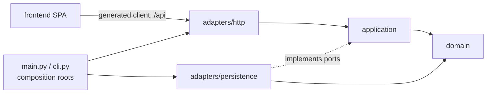
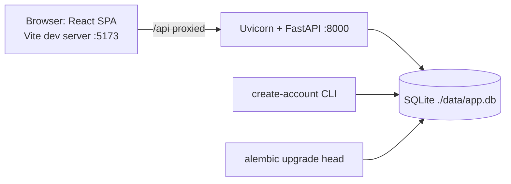
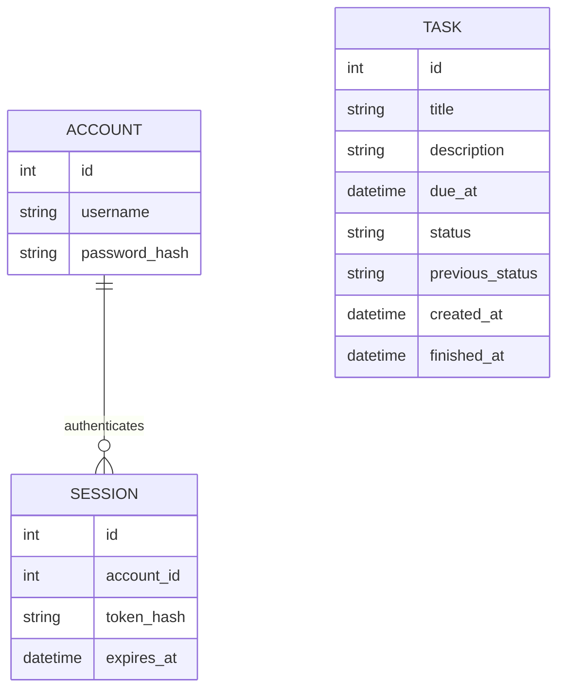

# Architecture Spine: Todo App (BMad Method demo)

## Design Paradigm

**Hexagonal (ports and adapters), light.** A pure domain core owns the Task, its status machine and every business rule. Application use cases orchestrate the domain through ports. Adapters plug FastAPI, SQLite and the system clock into those ports. Two composition roots wire everything together. The React SPA is an external client of the HTTP adapter.

| Layer | Location | Holds |
| --- | --- | --- |
| Domain | `src/bmad_first_project/domain/` | `Task`, `Status`, transition table, validation, overdue and ordering logic, domain errors; standard library only |
| Application | `src/bmad_first_project/application/` | One use case per user action, including `authenticate`; ports (`TaskRepository`, `SessionStore`, `AccountStore`, `UnitOfWork`, `Clock`, `PasswordHasher`); `TaskView` read model |
| HTTP adapter | `src/bmad_first_project/adapters/http/` | Routers, request and response schemas, auth and `now` dependencies, error handlers |
| Persistence adapter | `src/bmad_first_project/adapters/persistence/` | SQLModel tables, repositories, unit of work, `make_engine`, `UTCDateTime`, Alembic |
| Composition roots | `src/bmad_first_project/main.py`, `cli.py` | `create_app()` wiring; `create-account` command |
| Frontend | `frontend/` | React SPA; generated API client |

## Invariants & Rules



### AD-1: Dependencies point inward only [ADOPTED]

- **Binds:** all backend modules
- **Prevents:** business rules coupled to FastAPI, the ORM or the system clock; adapters wired together ad hoc
- **Rule:**
  - `domain/` imports only the Python standard library.
  - `application/` imports only `domain/` and its own ports.
  - An adapter may import `application/` and `domain/`, never another adapter.
  - Only `main.py` and `cli.py` import adapters, and they are the only modules that import more than one.
  - The import-boundary test in `tests/architecture/` enforces this allow-list, and also AD-4.

### AD-2: The domain is the single owner of business rules [ADOPTED]

- **Binds:** FR-4 to FR-16, NFR-1
- **Prevents:** rules duplicated or contradicted across schemas, endpoints, repositories or the frontend
- **Rule:**
  - Every **value** rule lives only in domain code: title trimmed, then non-empty and at most 200 code points; description at most 5,000 code points; due date-time required and not in the past when it changes ("changes" means a different instant).
  - Every status transition is decided by the domain's transition table, which mirrors PRD §4.3. Action endpoints are not idempotent: any action the table doesn't allow, including "—" cells and undo outside the window, raises `StateConflictError`.
  - Domain errors are `DomainValidationError`, `StateConflictError` (with an optional `reason`, such as `undo_window_expired`), `NotFoundError` and `UnauthenticatedError`.
  - HTTP schemas check **shape only**: types, required keys, offset-aware date-times (AD-13), and `extra="forbid"` on every request body. They carry no `Field` constraints on business values. The frontend never decides a rule.

### AD-3: One "now" per request, from the Clock port; aware UTC everywhere [ADOPTED]

- **Binds:** FR-1 to FR-5, FR-9 to FR-15, NFR-3, NFR-6
- **Prevents:** hidden clock reads, several "now" values in one request, and naive/aware datetime comparison errors
- **Rule:**
  - A request-scoped HTTP dependency reads the `Clock` port exactly once. That `now` is passed to `authenticate` and to the use case; the CLI reads the Clock once per command.
  - `datetime.now()`, `time.time()` and their equivalents appear only in the system clock adapter. This is enforced by Ruff `DTZ` and a banned-API rule, with a per-file exception for that adapter.
  - Every `datetime` inside the backend is timezone-aware UTC.
  - Time columns (`created_at`, `finished_at`, `due_at`, `expires_at`) are set only from a use case's `now` or from input. There are no database or ORM time defaults.

### AD-4: SQLModel lives only in the persistence adapter [ADOPTED]

- **Binds:** domain, persistence adapter
- **Prevents:** the domain `Task` becoming an ORM/Pydantic object, SQLModel 0.0.x churn spreading, and naive datetimes leaking out of SQLite
- **Rule:**
  - SQLModel and SQLAlchemy are imported only under `adapters/persistence/`.
  - Table classes (for example `TaskRow`) map to and from plain domain objects inside the repository.
  - One `UTCDateTime` type decorator stores UTC with microseconds and re-attaches UTC on read, so the domain never sees a naive value.
  - HTTP schemas are separate Pydantic models in `adapters/http/`.

### AD-5: Alembic owns the database schema [ADOPTED]

- **Binds:** persistence adapter, tests, local runtime
- **Prevents:** schema drift, ad hoc table creation, and tests migrating the wrong database
- **Rule:**
  - Every schema change is an Alembic migration. The app never calls `create_all`.
  - Migrations are applied explicitly with `uv run alembic upgrade head`. The app refuses to start if the schema is behind.
  - `env.py` takes its URL from `config.attributes["url"]` when present, otherwise from `Settings`.
  - One `make_engine(url)` builds every engine and turns SQLite `PRAGMA foreign_keys` on.
  - Each test database is a file under `tmp_path`, migrated with its URL and injected through the engine dependency override.

### AD-6: Authentication uses server-side session tokens [ADOPTED]

- **Binds:** FR-1, FR-2, FR-3, NFR-5
- **Prevents:** logout that does not revoke access, incompatible token hashing between login and checks, and auth tied to browsers
- **Rule:**
  - **Login:** `POST /api/auth/token` uses FastAPI's OAuth2 password form and returns `secrets.token_urlsafe(32)`. Only that response ever contains the token.
  - **Storage:** `sessions` stores the token's SHA-256 hex (unique) and `expires_at = now + 7 days`, set at login.
  - **Checking:** the `authenticate(token)` use case owns lookup and expiry. A session is valid only while `now < expires_at`; otherwise it raises `UnauthenticatedError`. The HTTP dependency reads the bearer header with `auto_error=False` and calls `authenticate`.
  - **Logout:** `POST /api/auth/logout` deletes the session row.
  - **Passwords:** `PasswordHasher` (pwdlib, Argon2) is for passwords only, never tokens.
  - **Account:** `create-account` creates the single account, or updates its password if it exists, and deletes all sessions.

### AD-7: Status changes happen only through action endpoints [ADOPTED]

- **Binds:** FR-5, FR-7 to FR-12
- **Prevents:** a generic status update bypassing the transition table, or "set status" being used as undo
- **Rule:**
  - `POST /api/tasks/{id}/start`, `/reopen`, `/complete`, `/cancel` and `/undo` each map to exactly one domain operation.
  - `PATCH /api/tasks/{id}` is a partial update of `title`, `description` and `due_at` only:
    - an omitted key means unchanged
    - `description: null` or `""` clears it (stored as `null`)
    - `title: null` or `due_at: null` is a validation error
    - any other key, including `status`, is rejected by `extra="forbid"`

### AD-8: Undo state is stored on the task [ADOPTED]

- **Binds:** FR-9 to FR-11, FR-15
- **Prevents:** competing undo designs (event history, client-side delay, status overwrite), and frontend timers that drift from the server
- **Rule:**
  - **Finishing:** completing or cancelling sets `previous_status` and `finished_at = now`.
  - **Undo:** the domain accepts undo only when the task is finished and `now − finished_at ≤ 5 s`. A successful undo restores `previous_status` and clears both fields. Otherwise it raises `StateConflictError(reason="undo_window_expired")`. The server is the only judge.
  - **Frontend:** the Undo control's 5-second timer starts when the action's success response arrives, never from the browser clock against `finished_at`. Undo state lives in one app-level store keyed by task ID, so it survives list refetches and filter changes. On `undo_window_expired` the control closes and shows the message.

### AD-9: Overdue is computed, never stored [ADOPTED]

- **Binds:** FR-14, FR-17, NFR-3
- **Prevents:** a stale stored flag, and routers reading the Clock to compute it
- **Rule:**
  - Use cases return `TaskView(task, is_overdue)`, computed by the domain with the request's single `now`.
  - Routers only map `TaskView` to `TaskResponse` and never touch the Clock.
  - `is_overdue` has no column.

### AD-10: The server owns list order [ADOPTED]

- **Binds:** FR-13, FR-15, FR-16
- **Prevents:** frontend and backend, or SQL and domain, sorting differently
- **Rule:**
  - **Endpoint:** `GET /api/tasks?status=<optional>` returns tasks in display order: active tasks in FR-13 order, then finished tasks in FR-15 order. An omitted `status` means All; an unknown value is a validation error.
  - **Ordering:** the ordering function lives only in the domain. The repository returns lists unordered.
  - **Frontend:** splits the list into sections by status and never re-sorts or filters by itself.

### AD-11: The frontend talks to the API only through the generated client [ADOPTED]

- **Binds:** `frontend/`, NFR-1
- **Prevents:** hand-written calls drifting from the API contract, duplicate client configuration, and client-side reordering
- **Rule:**
  - **Generation:** the client is generated from FastAPI's OpenAPI schema with `@hey-api/openapi-ts` (exact pinned version) and its TanStack Query plugin. Generated code is never edited by hand. Regenerating after a contract change is part of that change.
  - **Stable names:** the backend sets `generate_unique_id_function` to the route function name, and route functions are named after their use case (for example `complete_task`).
  - **One client:** `frontend/src/api/` configures the single client instance. Its base URL is the origin only, because OpenAPI paths already include `/api`. It reads the bearer token from one `localStorage` key and attaches it. On any `unauthenticated` response it clears the token and routes to login, except for the login request itself, whose error goes to the login form.
  - **Retries:** queries retry only network errors, never 4xx or 5xx responses; mutations are never retried.
  - **No other calls:** no other code calls the API. An ESLint rule bans `fetch` and `axios` outside generated code.
  - **No optimistic updates:** every mutation invalidates the `["tasks"]` queries and the list is refetched.

### AD-12: One error envelope, one precedence [ADOPTED]

- **Binds:** NFR-2, every endpoint
- **Prevents:** clients parsing different error shapes, and stories disagreeing on which error wins
- **Rule:**
  - **Shape:** every error response is `{"error": {"code": "<code>", "message": "<text>", "reason": "<optional>"}}`. Every route declares this `ErrorResponse` in its OpenAPI responses.
  - **Mapping:** done in exactly one place, the HTTP adapter's exception handlers:
    - `UnauthenticatedError` → `unauthenticated` (401)
    - `DomainValidationError` and request-validation errors → `validation_error` (422)
    - `StateConflictError` → `state_conflict` (409)
    - `NotFoundError` → `not_found` (404)
    - Starlette `HTTPException`s are wrapped too: 401 → `unauthenticated`, 404 → `not_found`, 405 → `method_not_allowed`.
  - **IDs:** path IDs are 64-bit integers. A non-integer is a shape `validation_error`; an out-of-range integer is `not_found`.
  - **Precedence:** `unauthenticated` > shape `validation_error` > `not_found` > `state_conflict` > value `validation_error`.
  - **Message voice:** every `message` is a short, plain sentence in the UX voice (EXPERIENCE.md Voice and Tone), because the frontend shows it as written. The request-validation handler replaces Pydantic's default text with a calm generic message. Fixed strings include "That time has already passed." and "That username and password don't match.".

### AD-13: Date-time wire format [ADOPTED]

- **Binds:** NFR-3, FR-4, FR-5, every date-time field
- **Prevents:** naive or ambiguous times and inconsistent time-zone handling
- **Rule:**
  - Incoming date-times must be ISO 8601 with an offset; naive values are a validation error.
  - Values are converted to aware UTC at the HTTP boundary and returned as ISO 8601 UTC with a `Z` suffix.
  - The frontend converts to the browser's time zone only for display.

### AD-14: Canonical Task shape [ADOPTED]

- **Binds:** FR-4 to FR-17, domain, persistence, HTTP, frontend
- **Prevents:** endpoints returning different task shapes, and disagreement over which fields exist
- **Rule:**
  - **Domain fields:** the domain `Task` has `id`, `title`, `description` (optional), `due_at`, `status`, `created_at`, `finished_at` (optional) and `previous_status` (optional).
  - **One response model:** `TaskResponse` carries all of those except `previous_status`, plus `is_overdue`.
  - **Single-task endpoints:** create (201), get, patch and every action endpoint return `TaskResponse` (200).
  - **List:** `GET /api/tasks` returns a bare JSON array of `TaskResponse`.
  - **No body:** `DELETE` and logout return 204.

### AD-15: Repository port and unit of work [ADOPTED]

- **Binds:** application, persistence adapter, HTTP adapter, CLI
- **Prevents:** competing commit owners, a second state-mutation path, a second sort, and unclear ownership of not-found
- **Rule:**
  - **Repository methods:** `TaskRepository` offers `get(id) -> Task | None`, `add(task) -> Task` (returns the task with its ID), `save(task)` (persists the whole task), `delete(id)` and `list(status | None) -> list[Task]` (unordered). There are no field-level update methods.
  - **Repository limits:** repositories never commit, never order and never raise domain errors. Use cases raise `NotFoundError` when they get `None`.
  - **Transactions:** a request-scoped `UnitOfWork` commits when the use case succeeds and rolls back on any exception. The CLI uses the same unit of work.

## Consistency Conventions

| Concern | Convention |
| --- | --- |
| Naming | Python: snake_case modules and functions, PascalCase classes. JSON fields: snake_case. Status values: `to_do`, `in_progress`, `done`, `cancelled`. Use cases and their route functions share a name (`complete_task`). |
| IDs | Integer, autoincrement, assigned by the database. Ascending ID is the final tie-break. |
| Routes | Everything under `/api`. Resources are plural nouns (`/api/tasks`); actions are verb sub-paths (`/api/tasks/{id}/complete`). |
| Config | pydantic-settings from environment variables. Default database path is `./data/app.db`, and `data/` is gitignored. Secrets are never committed. |
| Logging | Standard-library `logging`. Never log passwords, tokens or token hashes. |
| Local runtime | One-time setup: `uv run alembic upgrade head`, then `uv run create-account`. Run the backend with `uv run uvicorn bmad_first_project.main:create_app --factory` (port 8000) and the frontend with `npm run dev` in `frontend/` (port 5173, proxying `/api`). FastAPI does not serve the built SPA. |
| Entry points | `pyproject.toml` `[project.scripts]` replaces the placeholder `bmad-first-project` script with `create-account = "bmad_first_project.cli:create_account"`. |
| Tests | Domain: pure unit tests with an explicit `now`. API: FastAPI `TestClient`, a fresh migrated file database per test (AD-5) and a fake `Clock` injected through dependency overrides. Include a datetime round-trip test (AD-4). Frontend: Vitest with fake timers for components; Playwright, with its clock, for end-to-end checks of frontend-only behaviour (NFR-6). |
| Tooling | `uv` for Python dependencies and scripts; Ruff for linting and formatting (including `DTZ` and banned APIs, AD-3); npm and ESLint in `frontend/`. |

## Stack

| Name | Version |
| --- | --- |
| Python | 3.13 |
| FastAPI | 0.142.2 |
| Pydantic | 2.13.5 |
| pydantic-settings | 2.15.0 |
| python-multipart | 0.0.32 |
| Uvicorn | 0.54.0 |
| SQLModel | 0.0.47 |
| SQLAlchemy | 2.0.54 |
| Alembic | 1.20.0 |
| SQLite | bundled with Python 3.13 |
| pwdlib (argon2) | 0.3.1 |
| pytest | 9.1.1 |
| httpx | 0.28.1 |
| Ruff | 0.16.9 |
| React | 19.3.0 |
| Vite | 8.3.2 |
| TypeScript | 6.0.3 |
| Node.js | >= 22.18 (24.x LTS) |
| @hey-api/openapi-ts | 0.99.0 |
| @tanstack/react-query | 5.104.0 |
| Vitest | 5.0.3 |
| @playwright/test | 1.63.0 |
| ESLint | 10.11.0 |

## Structural Seed





```text
src/bmad_first_project/
  domain/              # Task, Status, transition table, rules, ordering, errors
  application/         # use cases (incl. authenticate), ports, TaskView
  adapters/
    http/              # routers, schemas, auth + now dependencies, error handlers
    persistence/       # SQLModel tables, repositories, unit of work, make_engine, alembic/
  main.py              # create_app(): composition root
  cli.py               # create-account: composition root
tests/
  domain/  api/  architecture/   # architecture/ = import-boundary test (AD-1, AD-4)
frontend/
  src/client/          # generated, never hand-edited (AD-11)
  src/api/             # the single client configuration and token store
  src/                 # React app
  e2e/                 # Playwright
data/                  # local SQLite file (gitignored)
```

## Capability → Architecture Map

| Capability / Area | Lives in | Governed by |
| --- | --- | --- |
| FR-1 to FR-3 Authentication | `authenticate`, login and logout use cases; auth dependency; sessions store; CLI | AD-3, AD-6, AD-12 |
| FR-4 to FR-6 Create, edit, delete | domain rules, use cases, `POST`/`PATCH`/`DELETE /api/tasks` | AD-2, AD-3, AD-7, AD-13, AD-14, AD-15 |
| FR-7 to FR-12 Status lifecycle | domain transition table, action endpoints | AD-2, AD-7, AD-8, AD-14 |
| FR-11 Frontend Undo control | app-level undo store in `frontend/` | AD-8, AD-11 |
| FR-13 to FR-16 List, overdue, finished, filter | domain ordering and overdue, `GET /api/tasks` | AD-9, AD-10, AD-14 |
| FR-17 Retrieve one task | `GET /api/tasks/{id}` | AD-9, AD-12, AD-14 |
| NFR-1 Frontend independence | API boundary, generated client | AD-2, AD-10, AD-11 |
| NFR-2 Errors | HTTP exception handlers | AD-12 |
| NFR-3 Time | Clock port, `UTCDateTime`, HTTP boundary | AD-3, AD-4, AD-13 |
| NFR-4 Performance | SQLite, domain ordering | Deferred (indexes) |
| NFR-5 Security | pwdlib, SHA-256 token hashes, logging rule | AD-6, Conventions |
| NFR-6 Testability | Clock port, per-test databases, Vitest and Playwright clocks | AD-3, AD-5, Conventions |
| UI look and behaviour | `frontend/` | Deferred to UX |

## Deferred

| Decision | Why it can wait |
| --- | --- |
| Deployment, hosting, HTTPS, serving the built SPA, and environments beyond local dev | The MVP runs locally. HTTPS becomes mandatory before any non-local deployment. |
| CI pipeline | No shared contributors yet; add when the first epic lands. |
| PostgreSQL or another database | AD-4 and AD-15 isolate persistence behind ports; switching is an adapter change. |
| Concurrency control and multi-user | Single user by PRD; revisit with more than one user or client. |
| Login rate limiting and lockout | Local single-user runtime; required before any network exposure. |
| Token storage hardening (httpOnly cookie) | `localStorage` is accepted for a local single-user app; revisit with deployment. |
| Database indexes and query tuning | 1,000-task target (NFR-4); add an index on `status, due_at` if measurement shows a need. |
| Frontend routing and component internals | Styling, component library (shadcn/ui) and the live, display-only overdue refresh are decided in the UX spines; they don't affect the API contract. |
| Upgrade to SQLAlchemy 2.1 | SQLModel 0.0.47 requires SQLAlchemy < 2.1; upgrade when SQLModel lifts that cap. |
| Upgrade to TypeScript 7 | `@hey-api/openapi-ts` 0.99.0 crashes with TypeScript 7.0 (hey-api issue #4235); upgrade when it is fixed. |
